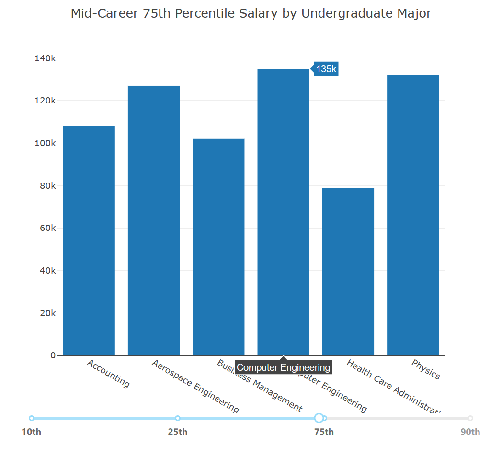

# HCI Lab 3: Data Visualization

**Author: 2152354 Karry Zhang**

**Github: https://github.com/Iuriak**

Data visualization is the representation of data through the use of common graphics, such as charts, plots, and infographics. These visual displays of information convey complex data relationships and data-driven insights in an easy-to-understand manner.

This HCI experiment will work on data visualization for a given dataset, where the development environment is PyCharm 2022.1.4 and the main installed modules include dash, plotly and pandas.

## 1. Describe a data analysis task for the chosen dataset 

### 1.1 objectives

"Salary Increase By Major" from the dataset was used for this Lab.

The dataset is used to show the impact of students' choice of major on their career salaries. Some majors may have low salaries in the short term, but significant increases; others may have fair salaries but mediocre increases, just as your parents may be concerned when you choose philosophy or international relations as your major. But a year-long survey by PayScale Inc. of 1.2 million people with only a bachelor's degree showed that graduates of these majors increased their earnings by 103.5 percent and 97.8 percent, respectively, about 10 years after graduation. Meanwhile, some of the majors that did not show as much of a wage increase included nursing and information technology.

Therefore this Lab hopes to show **the salary level of each major at different job stages**, **how the salary of a particular major changes with job stages**, and **how the average salary level of each major changes from the starting of the job to the mid-career**.

### 1.2 characteristic of dataset

The data set consists of the main column **"Undergraduate Major"**, and all subsequent columns are organized around this column, which I divide into two main sections:

The first part is a comparison of the starting and mid-career salary levels of each profession and their changes, including **"Starting Median Salary"**, **"Mid-Career Median Salary"**, and **"Percent change from Starting to Mid-Career Salary"**, which show the median starting salary, mid-career median salary, and starting salary of each profession respectively. The table shows the median starting salary, the median mid-career salary, and the increase in salary from starting to mid-career salary:

| Starting Median Salary | Mid-Career Median Salary | Percent change from Starting to Mid-Career Salary |
| ---------------------- | ------------------------ | ------------------------------------------------- |
| $46,000.00             | $77,100.00               | 67.6                                              |

The second part is the salary situation in the middle of the career, in the 10th, 25th, 75th and 90th years, so the **bar chart** can be used to compare the salary levels of different majors in the same period, and the **line chart** to show the change of salary levels of the same major in different career stages. The table is shown below:

| Mid-Career 10th Percentile Salary | Mid-Career 25th Percentile Salary | Mid-Career 75th Percentile Salary | Mid-Career 90th Percentile Salary |
| --------------------------------- | --------------------------------- | --------------------------------- | --------------------------------- |
| $42,200.00                        | $56,100.00                        | $108,000.00                       | $152,000.00                       |

## 2. Layout and Figures

### 2.1 dashboard design 

A page title and description of the dataset were designed first, with a clickable hyperlink to the original source of the dataset at "Salary Increase By Major";

Below the description is the main visualization area, and at the top of the area is a Dropdown multi-select box, which by default selects the first two rows of data displayed in the table, and can drop down to select multiple MAJOR entries, and the three charts will be updated accordingly after selection.

**The chart on the left side** shows the salary comparison of selected majors in the mid-career stage, where the career stage switch is realized by the Slider below the chart.

**The top right chart** is a line chart that shows by default the salary change of the major in the first row of the data set from the start to the mid-career stage. When the mouse is moved over the left chart, the upper right chart will then update to the corresponding data for that major when the mouse moves over the bar for that major.

**The chart at the bottom right** is a combined double chart of bar and line chart, with the left y-axis showing the range of salary change from the initial to the mid-term, and the right y-axis showing the salary level at the initial or mid-term. Below the chart there is a RadioItem component that can be used to switch the display mode of the bar chart ("stack" or "group").

Below the three charts is a detailed data set table with a small sorting triangle by the column names in the header, which can be pressed to rearrange the table according to the data in the current column in ascending or descending order. The bottom right corner of the table has a back and forth page flip function.

### 2.2 patterns revealed in the figures

The first bar chart shows the salary level of these majors at the corresponding stage according to the majors word selected by the user and the mid-career stage selected on the slider below, so that users can easily compare the salary level of each undergraduate major in the same period.

When the user moves the mouse over the first bar chart, the line chart on the right side will show the salary level changes of the corresponding major in each working career stage, for example, the chart shows "Salary changes over the Career with undergraduate major in Physics", the line chart allows users to see clearly the salary level of each stage, and the approximate increase between stages.

From the line graph, it can be reflected that the salary of each Undergraduate major, from starting to mid-career, basically shows an upward trend. The increase of the former job stage is smaller than the increase of the latter stage, and the mid-career 25th is the boundary. However, there are a few major's starting median salary is higher than mid-career 10th salary, such as Geography, History, etc.

The third chart will also show the median starting salary and mid-career salary of majors according to the majors selected by users with a bar chart, and each point of the line chart is the increase of the starting salary to the mid-career salary of the corresponding majors, which is convenient for users to compare the salary level of majors and their increase, so as to better realize career planning.

Through this chart we can clearly see: different Undergraduate major although the starting salary and mid-career are disparity, but the data set of major from the starting salary to mid-career salary basically have more than 50% of the increase. 

Also the third chart's can be switched to graph mode or stack mode via the RadioItem at the bottom for easy viewing and comparison.

## 3. Summary

Data visualization tools make it easy for me to add all kinds of information to my visuals. However, in data visualization, I need to be very careful about the additional information I have added before to focus the user's attention. For example, should I consider the need for data labels on each bar in a bar chart? Maybe only one or two are needed to help illustrate your point. Or do I need a very wide variety of colors to convey the information? Maybe too much color presentation instead of presenting the data easily to the user. These are all things to consider in design.

In addition, you can also think about the primary and secondary relationships and connections between multiple charts. For example, in this experiment, a dropdown is used to multi-select "Undergraduate Major", which generates a main chart showing the salary gap between each Major, and also a Salary change chart. When the mouse is moved over the main chart, a line graph of the career salary change of the major corresponding to the current mouse is also displayed on the right. The three charts are organized around a single data set, but are not fragmented from each other.